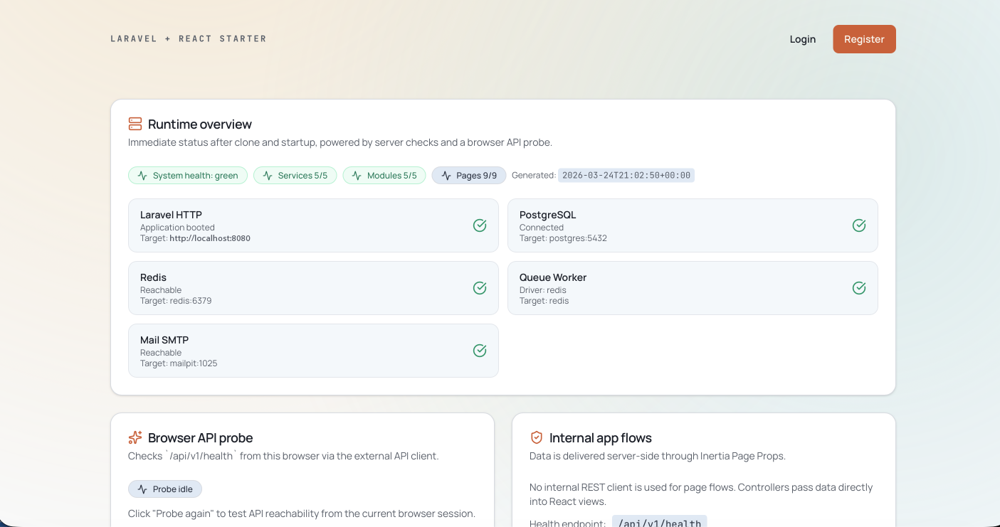

# Laravel 13 + React 19 Starter Kit

[](./LICENSE)


Production-ready fullstack starter kit with Laravel 13, React 19, and Inertia 2.
This repository focuses on clean architecture, Docker-first operations, fast local onboarding, and practical extensibility for real projects.

## Table of Contents

- [What Is Included](#what-is-included)
- [Screenshot](#screenshot)
- [Quick Start TL;DR](#quick-start-tldr)
- [Architecture at a Glance](#architecture-at-a-glance)
- [Tech Stack](#tech-stack)
- [Prerequisites](#prerequisites)
- [Quick Start (Local with Docker)](#quick-start-local-with-docker)
- [Optional Demo Login (Local)](#optional-demo-login-local)
- [Services, Ports, and Entry Points](#services-ports-and-entry-points)
- [Project Structure](#project-structure)
- [Development Workflow](#development-workflow)
- [Quality, Linting, and Tests](#quality-linting-and-tests)
- [Deployment](#deployment)
- [Server Operation (Your Own IP/Domain)](#server-operation-your-own-ipdomain)
- [External API (`/api/v1`)](#external-api-apiv1)
- [OpenAPI/Swagger](#openapiswagger)
- [Ops Scripts](#ops-scripts)
- [Troubleshooting](#troubleshooting)
- [Documentation](#documentation)
- [Contributing and Security](#contributing-and-security)
- [Repository Release Checklist](#repository-release-checklist)
- [Maintainer](#maintainer)
- [License](#license)

## What Is Included

- Laravel 13 on PHP 8.3+
- React 19 + TypeScript + Vite 8
- Inertia 2 for internal app flows
- PostgreSQL + Redis + Mailpit via Docker Compose
- Session auth for internal pages
- Sanctum token auth for external API endpoints
- OpenAPI documentation for `/api/v1`
- Linting, tests, and operational scripts (`verify`, `deploy`, `auto-update`)

## Screenshot

Runtime overview on the welcome page:



## Quick Start TL;DR

```bash
cp .env.example .env
docker compose up -d --build
docker compose exec app composer install
docker compose exec app php artisan key:generate
docker compose exec app php artisan migrate
./scripts/ops/verify-stack.sh --profile development
```

## Architecture at a Glance

### Internal Communication (Inertia)

- Data flow: Laravel controllers -> Inertia page props -> React components
- Internal pages do **not** use a separate REST client
- Internal authentication: session (`web` guard)

### External Communication (REST)

- Endpoints are versioned under `/api/v1`
- External authentication: Sanctum (`auth:sanctum`)
- CORS is limited to `api/v1/*`

### Runtime Path

```text
Browser
  -> nginx (port 8080)
    -> app (php-fpm, Laravel)
      -> PostgreSQL
      -> Redis

node (Vite, port 5173) for dev HMR
worker processes queue jobs
scheduler runs Laravel scheduler tasks
a mailpit service handles local SMTP testing
```

## Tech Stack

| Area | Technologies |
| --- | --- |
| Backend | Laravel 13, PHP 8.3+, PostgreSQL 17, Redis 7, Sanctum |
| Frontend | React 19, TypeScript 6, Vite 8, Tailwind CSS 4, shadcn/ui |
| Icons | Lucide React |
| API docs | L5 Swagger / swagger-php |
| Tests | Pest (backend), Vitest (frontend) |
| Standards | Laravel Pint, ESLint |
| Tooling | Docker, Docker Compose, pnpm, Node.js 22 |

## Prerequisites

- Docker Engine + Docker Compose
- Optional local tooling: PHP 8.3+, Composer, Node.js 22, pnpm

For the default workflow, Docker is fully sufficient.

## Quick Start (Local with Docker)

1. Clone the repository:

```bash
git clone https://github.com/BFlassig/stack-starterkit.git
cd stack-starterkit
```

2. Create environment file:

```bash
cp .env.example .env
```

3. Start containers:

```bash
docker compose up -d --build
```

4. Install backend dependencies and generate app key:

```bash
docker compose exec app composer install
docker compose exec app php artisan key:generate
```

5. Run migrations:

```bash
docker compose exec app php artisan migrate
```

6. Optional: ensure frontend dependencies are installed:

```bash
docker compose exec node sh -lc "corepack pnpm install"
```

7. Optional: regenerate Wayfinder and OpenAPI artifacts:

```bash
docker compose exec app php artisan wayfinder:generate --path=resources/js/lib/wayfinder
docker compose exec app php artisan l5-swagger:generate
```

## Optional Demo Login (Local)

Base seeding intentionally does **not** create a default login.
For local demos, create an optional demo user:

```bash
docker compose exec app php artisan db:seed --class=DemoUserSeeder
```

Demo credentials:

- Email: `test@example.com`
- Password: `password`

Login URL:

- local: `http://localhost:8080/login`
- server: `http://<your-ip-or-domain>:8080/login` (or your reverse-proxy URL)

## Services, Ports, and Entry Points

### Default Ports

| Service | Port | Purpose |
| --- | --- | --- |
| nginx/app | `8080` | Main application |
| node/vite | `5173` | Dev HMR |
| postgres | `5432` | Database |
| redis | `6379` | Cache/Queue/Session |
| mailpit SMTP | `1025` | SMTP testing |
| mailpit UI | `8025` | Mail UI |

### Important URLs

- `/` - welcome page with runtime overview
- `/login` - login
- `/dashboard` - internal dashboard (auth)
- `/api/v1/health` - API health endpoint
- `/docs/api` - Swagger UI
- `/docs/api-docs` - OpenAPI JSON

### Runtime Overview on `/`

The welcome page includes an operational status board with:

- service checks (Laravel HTTP, PostgreSQL, Redis, Queue, SMTP) including target (`host:port`)
- module status (Inertia, React/TS, API v1, Sanctum, OpenAPI)
- grouped page/endpoint overview (`Core`, `Data`, `Ops`, `Docs`)
- visibility labels (`public` vs `protected`)
- manual browser API probe against `/api/v1/health`
- server-generated timestamp

## Project Structure

```text
app/                 Laravel application logic
config/              Configuration (DB, CORS, Queue, Sanctum, Swagger)
database/            Migrations, factories, seeders
docker/              Dockerfiles, nginx config, runtime scripts
docs/                Architecture and project documentation
resources/js/        React/Inertia frontend
routes/              Web and API routes
scripts/ops/         Verify, deploy, and update scripts
tests/               Pest test suite
```

## Development Workflow

Start/stop the stack:

```bash
docker compose up -d
docker compose down
```

Watch logs:

```bash
docker compose logs -f app nginx worker scheduler node
```

Clear caches:

```bash
docker compose exec app php artisan optimize:clear
```

## Quality, Linting, and Tests

Frontend:

```bash
pnpm run lint:frontend
pnpm run test:frontend
pnpm run typecheck
```

Backend:

```bash
composer run lint:backend
composer run test:backend
```

In-container deterministic backend test run:

```bash
docker compose exec app composer run test:backend:docker
```

Full stack verification:

```bash
./scripts/ops/verify-stack.sh
./scripts/ops/verify-stack.sh --profile production
./scripts/ops/verify-stack.sh --strict-updates
```

## Deployment

### Staging

```bash
./scripts/ops/deploy-stack.sh --mode staging --env-file .env
```

### Production

```bash
./scripts/ops/deploy-stack.sh --mode production --env-file .env
```

### Dry Run (No Execution)

```bash
./scripts/ops/deploy-stack.sh --mode production --dry-run
```

Notes:

- Production deployment uses `composer install --no-dev`.
- If you need local dev checks (Pint/Pest) afterwards:

```bash
docker compose exec app composer install
```

## Server Operation (Your Own IP/Domain)

For server operation, at minimum adjust these `.env` values.

### Required Values

- `APP_URL` - public app URL
- `API_ALLOWED_ORIGINS` - allowed origins for external API calls
- `SANCTUM_STATEFUL_DOMAINS` - allowed stateful domains/hosts
- `VITE_HMR_HOST` - host/IP for Vite HMR in development

### Typical Additional Values

- `APP_PORT`, `VITE_PORT`
- `DB_*`
- `REDIS_*`
- `SESSION_DOMAIN`
- `SESSION_SECURE_COOKIE=true` when using HTTPS

### Example (Domain + HTTPS)

```env
APP_URL=https://app.example.com
API_ALLOWED_ORIGINS=https://app.example.com
SANCTUM_STATEFUL_DOMAINS=app.example.com
VITE_HMR_HOST=app.example.com
SESSION_DOMAIN=.example.com
SESSION_SECURE_COOKIE=true
```

### After `.env` Changes

```bash
docker compose down
docker compose up -d --build
docker compose exec app php artisan optimize:clear
```

## External API (`/api/v1`)

Current endpoints:

| Method | Path | Description | Auth |
| --- | --- | --- | --- |
| GET | `/api/v1/health` | Health status | no |
| GET | `/api/v1/user` | Current user | Sanctum token |

Example request:

```bash
curl -H "Authorization: Bearer <TOKEN>" http://localhost:8080/api/v1/user
```

## OpenAPI/Swagger

- UI: `http://localhost:8080/docs/api`
- JSON: `http://localhost:8080/docs/api-docs`

Regenerate docs:

```bash
docker compose exec app php artisan l5-swagger:generate
```

## Ops Scripts

- `scripts/ops/verify-stack.sh` - full verification workflow
- `scripts/ops/deploy-stack.sh` - reproducible deployment workflow
- `scripts/ops/auto-update-stack.sh` - dependency update automation
- `scripts/ops/upgrade-major-preview.sh` - major upgrade preview

Details: [scripts/ops/README.md](scripts/ops/README.md)

## Troubleshooting

### White screen / wrong Vite HMR URL

- Set `VITE_HMR_HOST` correctly
- Restart the node service:

```bash
docker compose restart node
```

- To work without HMR, build assets and remove `public/hot`:

```bash
docker compose run --rm --no-deps node sh -lc "corepack pnpm run build"
docker compose exec app sh -lc "rm -f public/hot && php artisan optimize:clear"
```

### Demo user login does not work

Run the optional demo seeder:

```bash
docker compose exec app php artisan db:seed --class=DemoUserSeeder
```

### Health check fails

```bash
docker compose ps
docker compose logs nginx app worker scheduler --tail=200
curl -i http://localhost:8080/api/v1/health
```

## Documentation

- Architecture phases 1-12: [docs/architecture/README.md](docs/architecture/README.md)
- Operational docs: [scripts/ops/README.md](scripts/ops/README.md)

## Contributing and Security

- Contribution guide: [CONTRIBUTING.md](CONTRIBUTING.md)
- Security policy: [SECURITY.md](SECURITY.md)
- Code of conduct: [CODE_OF_CONDUCT.md](CODE_OF_CONDUCT.md)

## Repository Release Checklist

- [ ] `.env` is not tracked in Git (`.env` is ignored)
- [ ] `.env.example` is complete and current
- [ ] `./scripts/ops/verify-stack.sh --profile development` passes
- [ ] `./scripts/ops/deploy-stack.sh --mode production --dry-run` passes
- [ ] README links and startup commands are validated
- [ ] No hardcoded secrets, domains, or private infrastructure details remain

## Maintainer

- GitHub: https://github.com/BFlassig
- LinkedIn: https://www.linkedin.com/in/benjaminflassig/

## License

MIT License, Copyright (c) 2026 Benjamin Flassig (https://github.com/BFlassig).
See [LICENSE](LICENSE).
